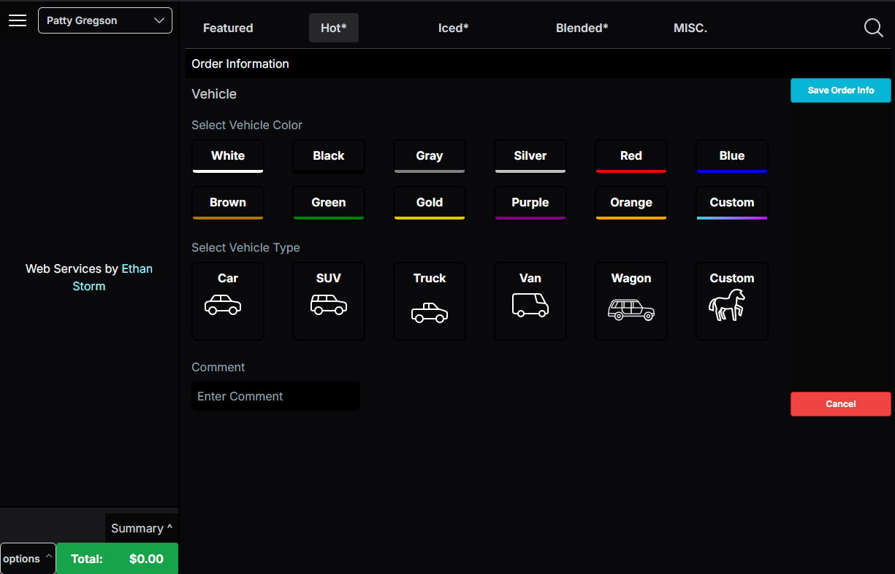

# DBDrinkBuilder

Dutch Bros Training is comprehensive but it needs a drink builder! Come here to practice making drinks ;)

[LIVE Web View](https://dbdrinkbuilder.vercel.app/)


## Features

- 1:1 replica of the DutchBros Order Builder
- Built for Ipads like the original
- Helps trainees develop good habits
- Helps trainees learn the menu, take orders, and create drinks
- Easy URL
- Beautiful UI
- Has 0 APIS, Auth, and complications

## Getting Started

- Clone the repo
- run `npm i` for dependencies

First, run the development server:

```bash
npm run dev
# or
yarn dev
# or
pnpm dev
# or
bun dev
```

Open [http://localhost:3000](http://localhost:3000) with your browser to see the result.
